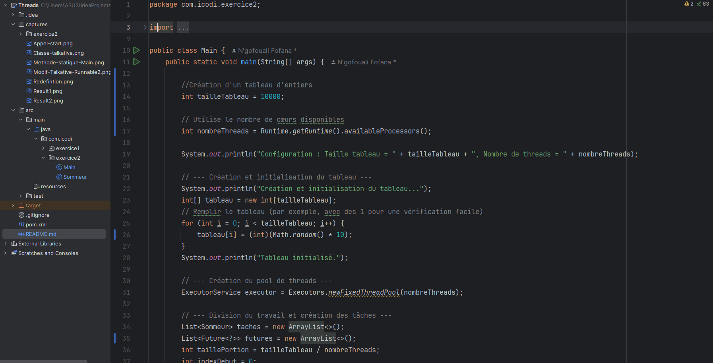

<h1>Activité Pratique</h1>

<h2>Exercice 1</h2>

<h3>1. Création de la classe Talkative</h3>

 
<h3>2. Modification de la classe pour implémenter Runnable</h3>

 
<h3>3. Rédéfinition de la méthode *run()* et affichage 100 fois de l'attribut</h3>

 
<h3>4. Création d'une méthode statique *Main()* avec 10 instances de la classe Thread</h3>

 
<h3>5. Appel de la méthode *start()* sur chaque objet de type Thread</h3>

 
<h3>6. Résultats des tests et constats</h3>

 

 
 

Après exécution du programme Main, on observe un entrelacement des sorties : Les messages affichés par les différents threads (avec Thread [id] : ...) 
ne s'affichent pas par blocs complets de 100 lignes pour chaque thread. Au lieu de cela, on observe des lignes provenant de différents threads mélangées.

 
 
<h2>Exercice 2</h2>
 
<h3>Création de la classe Sommeur implémentant Runnable</h3>
    <ul>
        <li>Création de la classe Sommeur implémentant Runnable</li>
        <li> + Constructeur de la classe Sommeur avec les arguments</li>
        <li> + Méthode getSommeur() renvoyant la somme calculée</li>
    </ul>

 
<h3>Création de la classe Main()</h3>
    <ul>
        <li>Division du tableau d'entiers en plusieurs plages et création d'un pool de threads</li>
        <li> + Fin des threads et affichage de la somme total du tableau</li>
    </ul>

 
 
 

